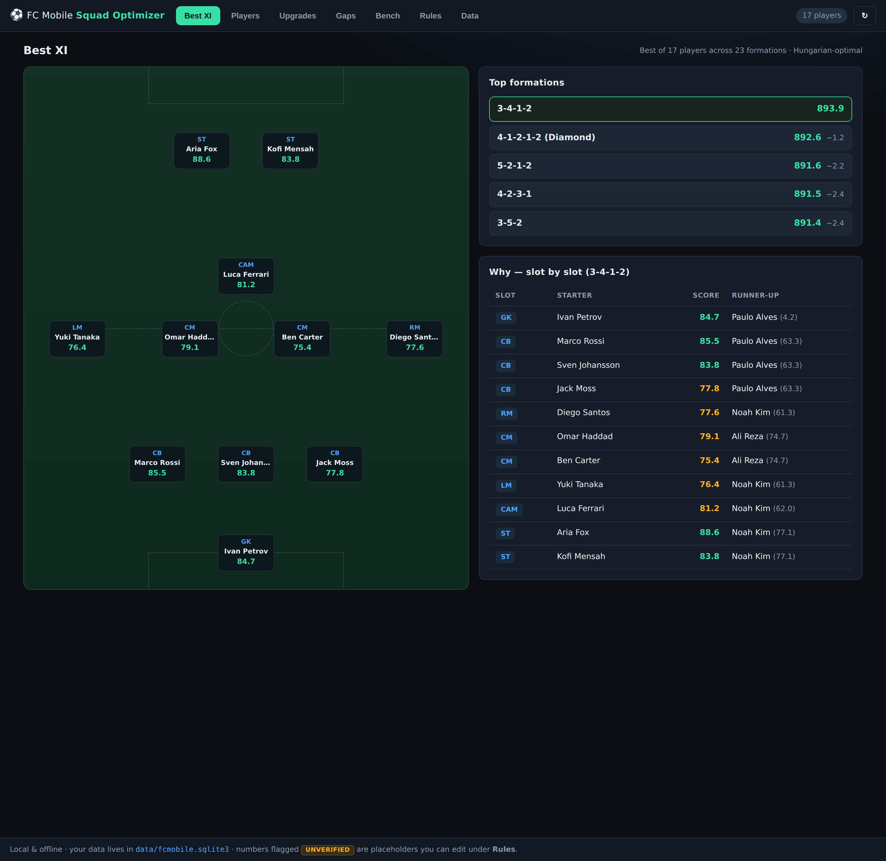
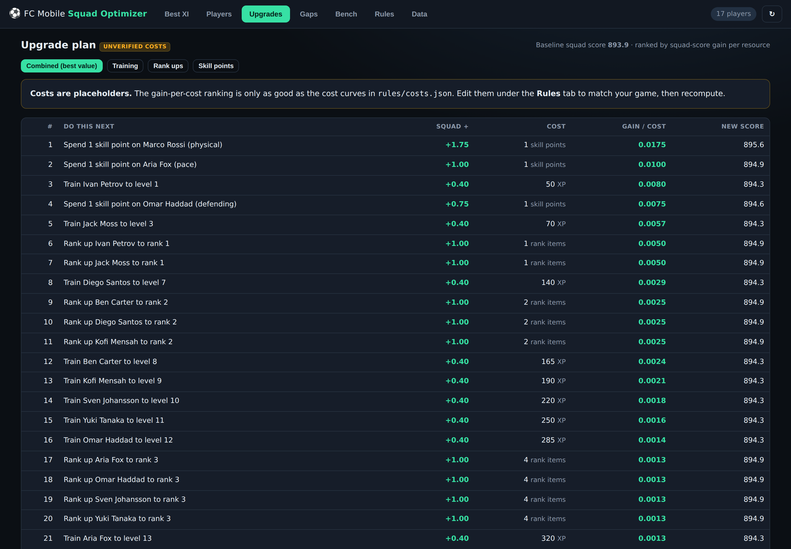
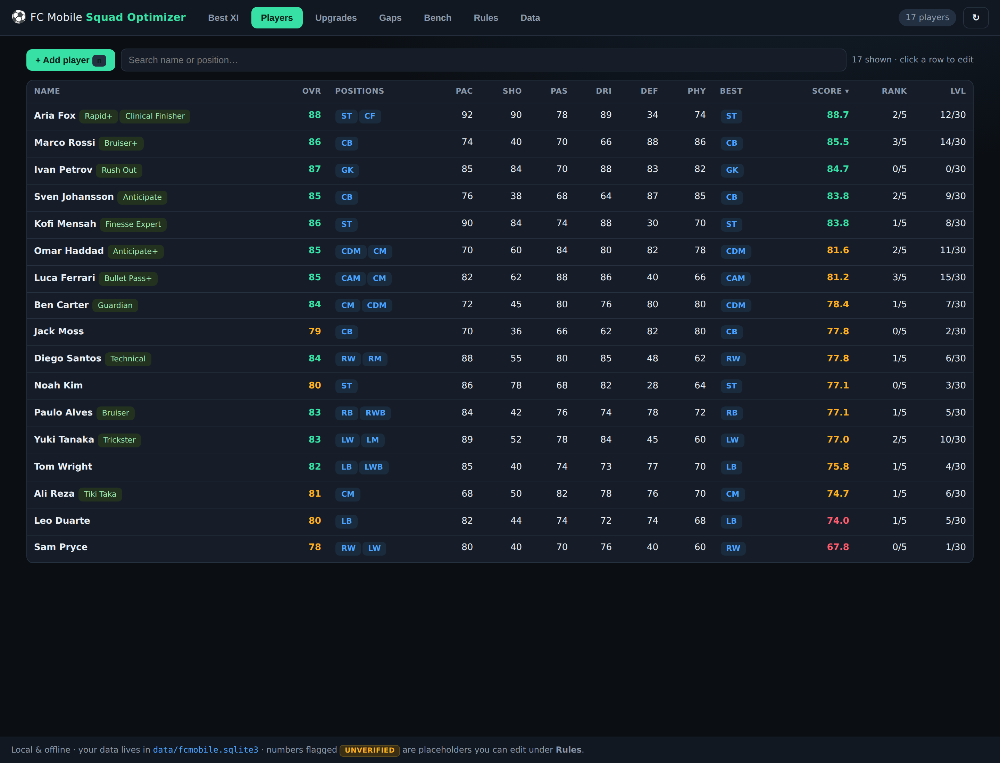
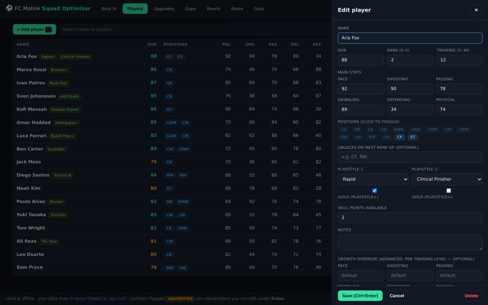
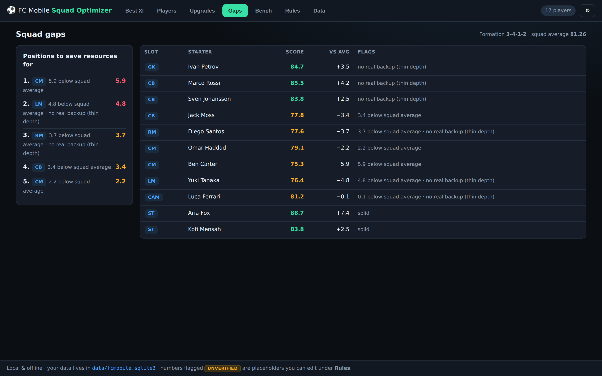
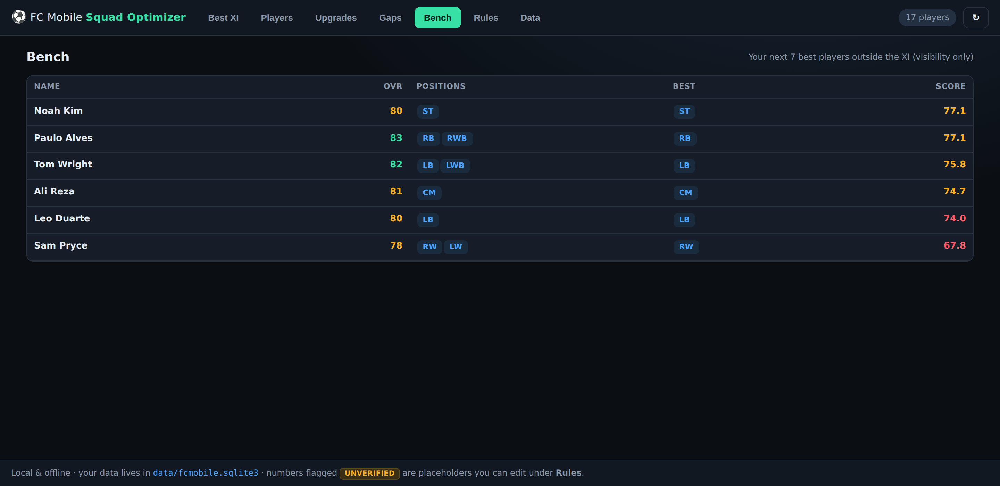
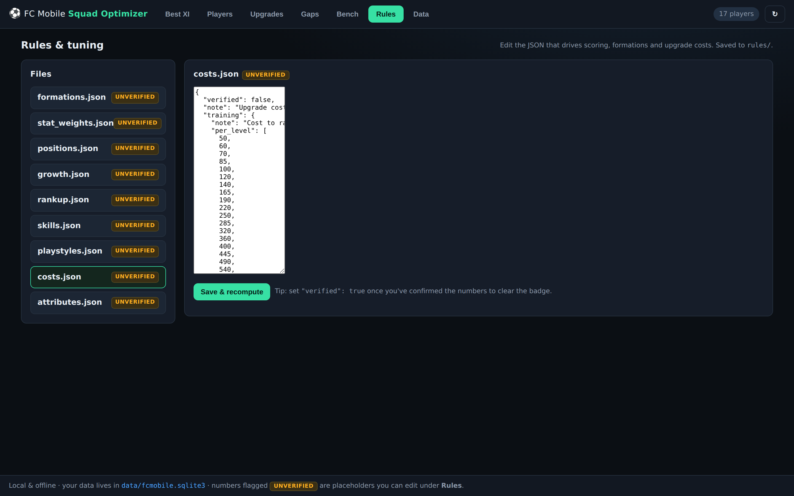
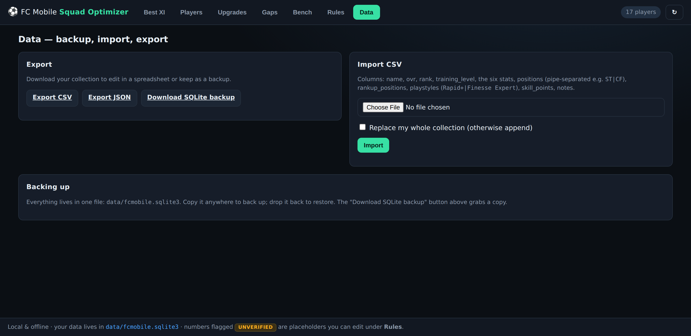

# ⚽ FC Mobile Squad Optimizer

A **local, free, offline** desktop app that works out the strongest starting XI you can
field in EA Sports FC Mobile from the players you own — and tells you where to spend
your upgrade resources next.

- Runs entirely on your machine. No account, no cloud, no paid APIs, no subscriptions.
- One file holds all your data (`data/fcmobile.sqlite3`) — back it up by copying it.
- **Pure Python. Node.js is _not_ required.** Launch it by double-clicking `start.bat`
  and it opens a real dashboard in your browser.

> **New here?** The easy, step-by-step install guide is **[docs/SETUP_WINDOWS.md](docs/SETUP_WINDOWS.md)**.

---

## What it looks like

### Best XI — optimal formation + starting XI, with the reasoning
For **every** formation it solves the exact best assignment of your players to the 11
slots (Hungarian algorithm), ranks the formations, and shows *why* each slot was filled
the way it was (including the runner-up).



### Upgrade plan — what to train / rank up next, best value first
Every possible next upgrade (one training level, one rank up, one skill point) is
simulated, the squad is re-optimised, and the results are ranked by **squad-score gain
per resource spent**. Upgrading a benched player is included — an upgrade that flips them
into the XI can be worth more than improving a starter.



### Players — dense, fast, keyboard-friendly
Add or edit a player in seconds. Click any row to open the editor.



### Player editor
Positions are click-to-toggle chips; PlayStyles, per-player growth override, skill
points and everything else are here. Press <kbd>Ctrl</kbd>+<kbd>Enter</kbd> to save.



### Gap report — where your squad is thin
Which slots are weakest relative to the rest of the squad, which are filled by an
out-of-position player, and which have no genuine specialist — in priority order.



### Bench view
Your next 7 best players outside the XI (visibility only — not optimised).



### Rules & tuning
Every game rule and tuning number the app uses lives in editable JSON. Numbers we could
**not** verify from a free public source are flagged `UNVERIFIED` so you know exactly
what to correct.



### Data — backup, import, export
Export/import CSV or JSON, and download a one-click SQLite backup.



---

## Quick start

### Windows (recommended)
1. Install **Python 3.10+** from <https://www.python.org/downloads/> — tick
   *“Add Python to PATH”* during setup.
2. Download this project (green **Code → Download ZIP** on GitHub) and unzip it.
3. **Double-click `start.bat`.**
   - The first run creates a private environment and installs dependencies (a couple of
     minutes). Every run after that is instant.
   - Your browser opens automatically at `http://127.0.0.1:8000`.
4. Optional: click **Data → Import CSV**, or load the sample squad (see below) to try it.

Full walk-through with screenshots and troubleshooting: **[docs/SETUP_WINDOWS.md](docs/SETUP_WINDOWS.md)**.

### macOS / Linux
```bash
./start.sh
```

### Load a sample squad to explore first (optional)
```bash
python seed_sample.py --replace
```
Then launch. Delete the samples any time from the **Players** tab.

---

## How it works

### The score (fully swappable)
**Squad score = the sum of the 11 per-slot scores.** A slot score is:

- **Outfield:** a position-weighted average of the six main stats — a CB’s Defending and
  Physical count for far more than their Shooting. Weights live in
  [`rules/stat_weights.json`](rules/stat_weights.json).
- **GK:** keepers use their own six stats — **Diving, Handling, Kicking, Reflexes,
  Positioning, Physical**. Select GK as a position and the stat fields relabel
  automatically; the keeper is then scored from those (falling back to OVR if you
  leave them blank).
- **Out of position:** the score is multiplied by a penalty (a non-keeper in goal, or a
  keeper outfield, is effectively ruled out). See [`rules/positions.json`](rules/positions.json).
- **PlayStyles** add a small bonus to the relevant main stat(s), with a stronger **Gold**
  tier (PlayStyle+). The full FC Mobile list is in
  [`rules/playstyles.json`](rules/playstyles.json), grouped by category (Ball Control,
  Passing, Finishing, Defending, Physical, Goalkeeping).

You entered these decisions as tunable data, so change any weight and recompute — the whole
scoring model lives in `backend/scoring.py` and the rules files, in one place.

### The optimiser
For each formation in [`rules/formations.json`](rules/formations.json) it builds a
player-to-slot cost matrix and solves it exactly with
`scipy.optimize.linear_sum_assignment` (the Hungarian algorithm). All formations are
solved and ranked — it is not an approximation. Top 5 are shown with the score gap
between them.

### The upgrade planner
It measures the **marginal** squad-score gain of each candidate upgrade by re-running the
optimiser with that one change applied, then divides by the resource cost. Because costs
come in three currencies (training XP, rank-up items, skill points), the *Combined* tab
converts them to a common unit using the `normalization` block in
[`rules/costs.json`](rules/costs.json) — edit that to reflect how scarce each resource is
for you. There are also per-currency tabs.

**Skill points** follow FC Mobile’s rules: a point’s value scales with the card’s base OVR
(≤74 → small, 74–84 → medium, 85+ → large — see [`rules/skills.json`](rules/skills.json)),
and the planner spends it on the stat that matters most for that player — the stats their
**PlayStyles** boost first, then their **position’s** key stats (from the attribute map in
[`rules/attributes.json`](rules/attributes.json)). **Training transfer** (moving training
between players for a small fee) is documented in [`rules/costs.json`](rules/costs.json).

---

## The rules files (and the `UNVERIFIED` flag)

All of this is data you can edit — under the **Rules** tab in the app, or directly in the
`rules/` folder:

| File | What it controls |
|---|---|
| `formations.json` | The formations solved (each = 11 slot positions). |
| `stat_weights.json` | Per-position weighting of the six main stats (scoring). |
| `positions.json` | Position list + out-of-position penalties. |
| `growth.json` | Default per-level training growth (override per player in the UI). |
| `rankup.json` | OVR/stat gains per rank up. |
| `skills.json` | Effect of a skill point. |
| `playstyles.json` | PlayStyles and their stat bonuses. |
| `costs.json` | Upgrade cost curves + how currencies compare. |
| `attributes.json` | Optional advanced sub-attribute → main-stat roll-up (scaffold). |

**Why the flags?** There is **no open, free, legal dataset of FC Mobile numbers** — the
public FIFA/FC datasets are all *console/PC* data, whose values don’t match FC Mobile. So
anything the app can’t verify ships as a clearly-labelled **placeholder** with
`"verified": false`, and the UI shows an `UNVERIFIED` badge wherever those numbers are
used. Correct them to match your game, set `"verified": true`, and the badge clears. The
app never silently invents a game formula.

> **On logging into your EA account:** there is no public FC Mobile API, and automating
> account access would breach EA’s terms and risk your account, so the app does **not** do
> it. Manual entry (below) is the supported path, and it’s built to be fast.

---

## Getting your players in

- **Manual entry:** click **+ Add player** (or press <kbd>n</kbd>). Enter OVR, the six main
  stats as shown in-game, positions, PlayStyles, rank and training level.
- **Duplicate:** editing is faster when you start from a similar card (create, tweak, save).
- **CSV bulk import/export:** **Data** tab. Columns:
  `name, ovr, rank, training_level, pace, shooting, passing, dribbling, defending,
  physical, positions, rankup_positions, playstyles, skill_points, notes`
  where `positions`/`rankup_positions` are pipe-separated (`ST|CF`) and `playstyles` use a
  `+` suffix for PlayStyle+ (`Rapid+|Finesse Expert`).

---

## Backup & restore

Everything is in **one file**: `data/fcmobile.sqlite3`.

- **Back up:** copy that file somewhere safe, or use **Data → Download SQLite backup**.
- **Restore:** drop the file back into `data/` (replacing the current one) and relaunch.
- You can also export/import JSON or CSV from the **Data** tab.

---

## Keyboard shortcuts

| Key | Action |
|---|---|
| <kbd>1</kbd>–<kbd>7</kbd> | Switch tabs (Best XI … Data) |
| <kbd>n</kbd> | Add a new player |
| <kbd>r</kbd> | Recompute the current view |
| <kbd>Ctrl</kbd>+<kbd>Enter</kbd> | Save (in the editor) |
| <kbd>Esc</kbd> | Close the editor |

---

## Running the tests

```bash
python -m pytest
```
The optimizer and scoring are covered by unit tests built on small, hand-checkable
squads (`tests/`).

---

## Project structure

```
FC-Mobile-Team-Selector/
├─ start.bat / start.sh     # one-click / one-command launch
├─ run.py                   # starts the server + opens the browser
├─ requirements.txt
├─ seed_sample.py           # optional demo squad
├─ backend/                 # FastAPI app
│  ├─ main.py               # REST API + serves the GUI
│  ├─ models.py  db.py      # SQLite data model
│  ├─ scoring.py            # the scoring function (swappable)
│  ├─ optimizer.py          # Hungarian solve across all formations
│  ├─ upgrades.py           # marginal-gain-per-cost planner
│  ├─ analysis.py           # gap report + bench
│  ├─ rules.py  csvio.py    # rules loader, CSV import/export
├─ frontend/                # vanilla HTML/CSS/JS dashboard (no build step)
├─ rules/                   # editable game-rule / tuning JSON
├─ tests/                   # optimizer + scoring unit tests
└─ data/                    # your SQLite file lives here (git-ignored)
```

## Tech

Python · FastAPI · SQLModel/SQLite · SciPy · vanilla HTML/CSS/JS. Chosen to be boring and
still runnable years from now, with no Node toolchain required.
